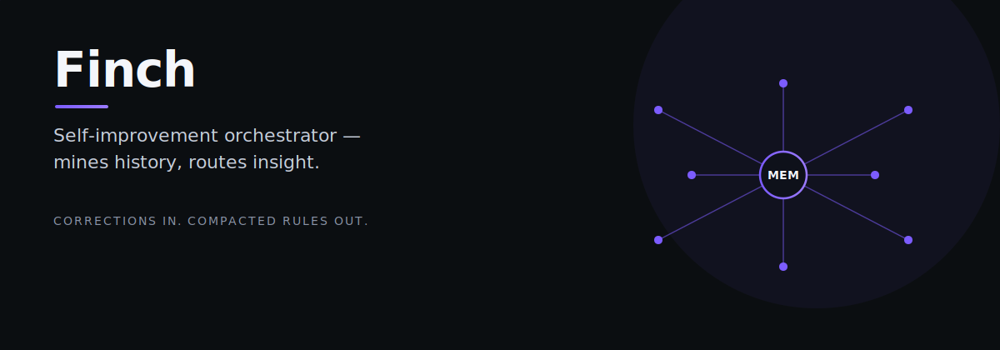

# finch

finch — Finch: self-improvement orchestrator — mines session history to detect corrections, breakthroughs, and behavioral patterns.

> Tell it what you need. It does the work.

## What it does

1. **Mines** session JSONL files for learning signals using regex pattern matching
2. **Compacts** MEMORY.md to stay within the 2,200 char limit (dedup, re-rank, evict, compress)
3. **Routes** each finding to the optimal target (MEMORY.md for behavioral rules, skill patches for methodologies)
4. **Emits** OCAS Action Journals and DecisionRecords per the OCAS spec
5. **Applies** changes with user review (weekly) or auto-applies low-risk findings (daily)

---

*finch is part of the [OCAS Agent Suite](https://github.com/indigokarasu).*